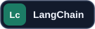
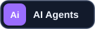
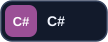
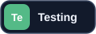

<h1 align="center">Nurgeldi Yessengeldi</h1>

<strong>AI Engineer · Backend Engineer · Full-stack Builder</strong>

Building scalable AI products and systems from zero to deployment.

  
  &nbsp;
  

## About me

I build **scalable software from zero to fully deployed products**: architecture, backend systems, AI features, web and mobile interfaces, testing, and infrastructure. My main language is **Python**, and I focus on applied AI—RAG, embeddings, vector search, AI agents, and agentic systems that solve real problems.

I use **agentic development tools** to move from idea to working product quickly while staying responsible for the architecture, correctness, and quality. I'm a tech and startup enthusiast who enjoys building.

## Skills & tools

### AI & Python

  
  
  
  
  
  
  
  
  
  

### Backend & data

  
  
  
  
  
  
  
  
  

### Web & mobile

  
  
  
  
  

### Infrastructure & quality

  
  
  
  
  
  
  
  
  

### Games & VR

  
  
  

<!-- Add a Selected projects section here when you have case studies to share. -->
